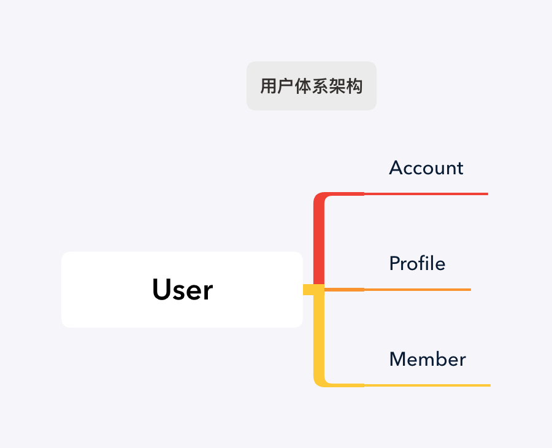

## 用户体系

* User 为用户体系的中心模型，代表一个独立在应用中活跃的人，主要处理登陆相关功能；User 与 Account/Profile/Member 均为一对多关系。
  * Account: 处理用户的账号信息，一个用户可以绑定多个登陆账号，如邮箱、手机号、唯一设备ID，功能主要在[rails_auth](https://github.com/work-design/rails_auth)中实现；
  * Profile: 用户资料（画像），处理用户的个人信息，记录诸如性别、生日、地址等个人信息，一个用户可以有多份资料，功能主要在[rails_profile](https://github.com/work-design/rails_profile)实现；
  * Member: 处理用户的组织成员信息，本模型所记录的数据不能脱离组织存在，如入职日期，功能主要在[rails_org](https://github.com/work-design/rails_org)实现

* Account/Profile/Member 均包含 identity 字段，除了与 User 直接关联，彼此之间也存在关联关系，通过 identity 来相互关联。
