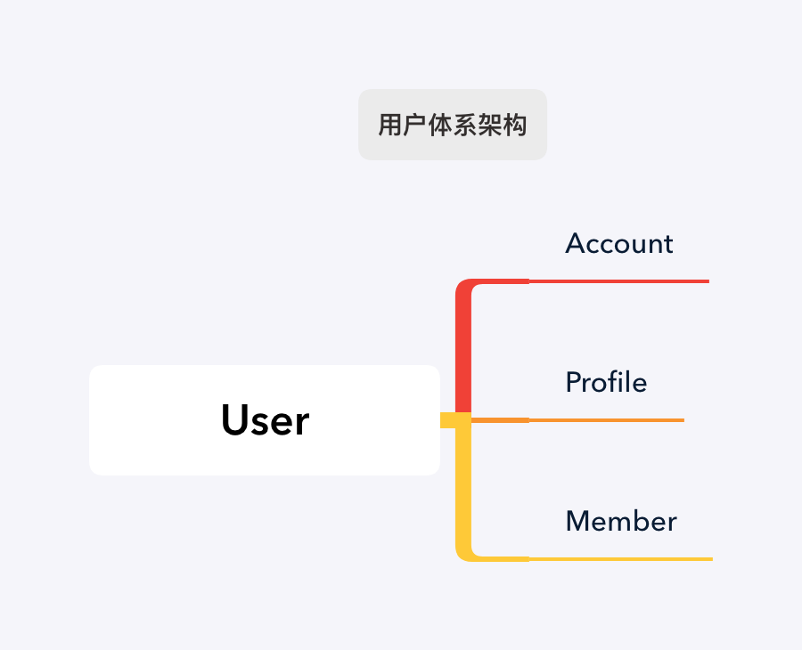

## 用户体系

### 说明

* User 为用户体系的中心模型，代表一个独立在应用中活跃的人，主要处理登陆相关功能；User 与 Account/Profile/Member 均为一对多关系。

  * Account: 处理用户的账号信息，一个用户可以绑定多个登陆账号，如邮箱、手机号、唯一设备ID，功能主要在[rails_auth](https://github.com/work-design/rails_auth)中实现；

  * Profile: 用户资料（画像），处理用户的个人信息，记录诸如性别、生日、地址等个人信息，一个用户可以有多份资料，功能主要在[rails_profile](https://github.com/work-design/rails_profile)实现；

  * Member: 处理用户的组织成员信息，本模型所记录的数据不能脱离组织存在，如入职日期，功能主要在[rails_org](https://github.com/work-design/rails_org)实现

* Account/Profile/Member 均包含 identity 字段，除了与 User 直接关联，彼此之间通过 identity 来相互关联。

### 设计思考

* 本架构设计首先考虑的是满足如 SaaS 系统的复杂场景：

用户可以自己注册登陆，也可能由组织管理人员在后台为其添加账号及其相关信息，这两个场景是相互隔离的。

最佳的方案就是：两个渠道都可能发生的信息添加，需要一个能验证用户身份的唯一标记。当用户完成了该账号的验证，则相关的数据会自动绑定到其在系统里的唯一身份 User 模型上。

Profile、Member是后台可能存在添加数据情形的，Account 主要用于处理账号验证。

* 数据迁移及合并

在用户能够验证身份之前，有些系统活动可能会提前发生，比如生成订单、生成身份二维码，为了简化系统的复杂性，最好通过 User 模型来处理这些数据。

而当用户实行验证身份操作的时候，用户可能已经通过其他账号在系统里有过活动了，也就是说有另外一个 User 模型指向同一个用户。这显然违背了 User 模型的设计初衷，于是就涉及到用户的数据合并。

当存在多个Account时，我们需要用户选择其中一个 Account 为主账号。我们只需要将实际属于当前用户的其他 Account 对应的 User 数据替换成主账号所对应的 User模型即可。

在这个架构体系下，只需要遍历数据库，将准备废弃的 User 模型 ID 替换成当前住账号的User ID即可。

